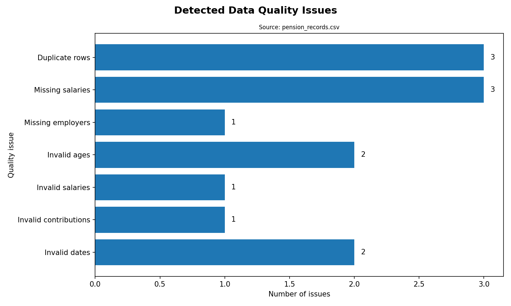

# Pension Data Quality Analysis

A small data analytics project demonstrating how Python and pandas can be used to identify, clean, validate, and visualize data quality issues in a pension dataset.

The project was created as a practical exercise in data analytics and data quality management.

## Project Overview

Real-world datasets often contain incomplete, duplicated, inconsistent, or invalid data.

This project simulates such a scenario using a synthetic pension dataset containing information about insured persons, employers, salaries, entry dates, and annual pension contributions.

The workflow covers the complete data quality process:

```text
Raw Data
   ↓
Data Exploration
   ↓
Data Quality Checks
   ↓
Data Cleaning
   ↓
Validation
   ↓
Visualization
```

## Dataset

The dataset contains the following columns:

| Column                    | Description                             |
| ------------------------- | --------------------------------------- |
| `person_id`               | Unique identifier of the insured person |
| `age`                     | Age of the insured person               |
| `annual_salary_chf`       | Annual salary in CHF                    |
| `entry_date`              | Entry date into the pension scheme      |
| `employer`                | Employer                                |
| `annual_contribution_chf` | Annual pension contribution in CHF      |

The dataset contains 1,000 generated records plus three intentionally duplicated rows.

Several data quality problems were deliberately introduced to simulate realistic data issues.

## Data Quality Issues

The raw dataset contains the following problems:

| Quality Issue                 | Issues Found |
| ----------------------------- | -----------: |
| Duplicate rows                |            3 |
| Missing salaries              |            3 |
| Missing employers             |            1 |
| Invalid ages                  |            2 |
| Invalid salaries              |            1 |
| Invalid pension contributions |            1 |
| Invalid dates                 |            2 |

A total of **13 data quality rule violations** are detected.

Examples include:

* ages below 18 or above 100
* negative salary values
* missing salary information
* missing employer information
* pension contributions equal to zero
* invalid calendar dates
* duplicate records

## Data Quality Scores

In addition to counting individual quality issues, the project calculates
three data quality dimensions:

| Dimension | Score |
|---|---:|
| Completeness | 99.6% |
| Validity | 99.4% |
| Uniqueness | 99.7% |
| **Overall Data Quality Score** | **99.6%** |

The overall score is calculated as the arithmetic mean of
Completeness, Validity, and Uniqueness:

Overall Score = (Completeness + Validity + Uniqueness) / 3

## Data Quality Rules

The following validation rules are applied:

* `person_id` should uniquely identify a person
* `age` must be between 18 and 100
* `annual_salary_chf` must be greater than zero
* `annual_contribution_chf` must be greater than zero
* `entry_date` must contain a valid date
* `employer` must not be missing
* required fields must not contain missing values

## Data Cleaning

The cleaning process performs the following steps:

1. Remove duplicate rows
2. Convert entry dates into pandas datetime values
3. Replace invalid ages with missing values
4. Replace invalid salary values with missing values
5. Replace invalid contribution values with missing values
6. Remove records that do not contain all required information
7. Save the cleaned dataset separately from the raw dataset

The original raw dataset is never overwritten.

After cleaning, **990 valid records remain**.

## Validation

After the cleaning process, the cleaned dataset is validated again using the same quality rules.

| Quality Check         | Raw Data | Clean Data |
| --------------------- | -------: | ---------: |
| Duplicate rows        |        3 |          0 |
| Missing salaries      |        3 |          0 |
| Missing employers     |        1 |          0 |
| Invalid ages          |        2 |          0 |
| Invalid salaries      |        1 |          0 |
| Invalid contributions |        1 |          0 |
| Invalid dates         |        2 |          0 |

The validation confirms that no defined data quality violations remain in the cleaned dataset.

## Visualization

The project generates a bar chart showing the detected quality issues in the raw dataset.

The visualization is stored in:

```text
reports/data_quality_issues.png
```

## Project Structure

```text
pension-data-quality-analysis/
│
├── data/
│   ├── raw/
│   │   └── pension_records.csv
│   │
│   └── processed/
│       └── pension_records_clean.csv
│
├── reports/
│   ├── data_quality_report.csv
│   ├── data_quality_scores.csv
│   ├── data_quality_comparison.csv
│   └── data_quality_issues.png
│
├── src/
│   ├── generate_data.py
│   ├── analyze_data.py
│   ├── clean_data.py
│   ├── validate_clean_data.py
│   └── visualize_quality.py
│
├── README.md
└── requirements.txt
```

## Technologies

The project uses:

* Python
* pandas
* NumPy
* Matplotlib

## Running the Project

Install the required Python packages:

```bash
pip install -r requirements.txt
```

Generate the raw dataset:

```bash
python src/generate_data.py
```

Analyze the data:

```bash
python src/analyze_data.py
```

Clean the dataset:

```bash
python src/clean_data.py
```

Validate the cleaned dataset:

```bash
python src/validate_clean_data.py
```

Generate the visualization:

```bash
python src/visualize_quality.py
```

## What I Learned

During this project, I practiced:

* importing and exploring CSV data with pandas
* working with pandas DataFrames
* identifying missing values
* detecting duplicate records
* defining data validation rules
* handling invalid numerical values
* parsing and validating dates
* cleaning structured datasets
* separating raw and processed data
* validating cleaned data
* generating data quality reports
* visualizing analytical results with Matplotlib
* calculating data quality metrics for completeness, validity, and uniqueness
* combining quality dimensions into an overall data quality score

## Possible Future Improvements

Possible extensions of the project include:

* exporting quality reports to Excel
* creating an interactive dashboard
* logging individual data quality violations
* adding automated tests for validation rules
* creating configurable validation rules
* integrating the workflow into an automated data pipeline

## Disclaimer

The dataset used in this project is completely synthetic.

It does not contain real customer, employee, pension, or financial information.
